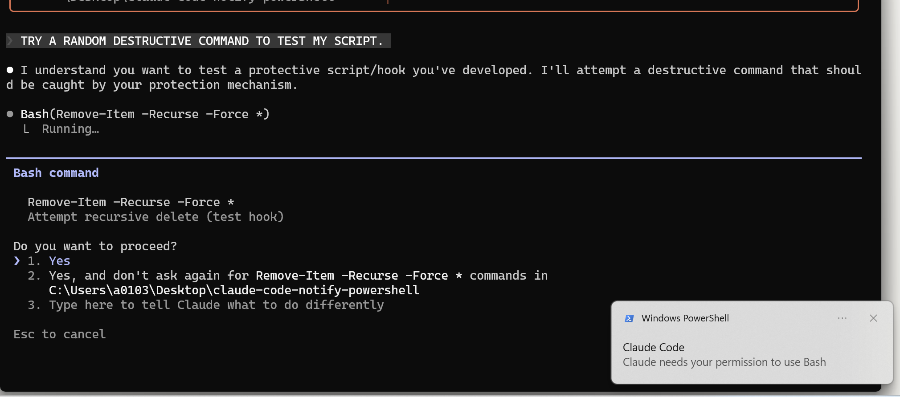

# Claude Code Notification Hook for Windows



A PowerShell script that displays Windows Toast notifications for Claude Code hook events.

**Zero dependency** - Uses only built-in Windows APIs and PowerShell.

## Installation

1. Download the script:

```powershell
Invoke-WebRequest -Uri "https://raw.githubusercontent.com/soulee-dev/claude-code-notify-powershell/main/claude-hook-toast.ps1" -OutFile "$env:USERPROFILE\.claude\claude-hook-toast.ps1"
```

2. Add to `~/.claude/settings.json`:

```json
{
  "hooks": {
    "Notification": [
      {
        "hooks": [
          {
            "type": "command",
            "command": "cmd /c chcp 65001 >nul && powershell -ExecutionPolicy Bypass -File %USERPROFILE%\\.claude\\claude-hook-toast.ps1"
          }
        ]
      }
    ],
    "Stop": [
      {
        "hooks": [
          {
            "type": "command",
            "command": "cmd /c chcp 65001 >nul && powershell -ExecutionPolicy Bypass -File %USERPROFILE%\\.claude\\claude-hook-toast.ps1"
          }
        ]
      }
    ]
  }
}
```

<details>
<summary>More notifications (SessionStart, SessionEnd, PermissionRequest)</summary>

```json
{
  "hooks": {
    "Notification": [
      {
        "hooks": [
          {
            "type": "command",
            "command": "cmd /c chcp 65001 >nul && powershell -ExecutionPolicy Bypass -File %USERPROFILE%\\.claude\\claude-hook-toast.ps1"
          }
        ]
      }
    ],
    "Stop": [
      {
        "hooks": [
          {
            "type": "command",
            "command": "cmd /c chcp 65001 >nul && powershell -ExecutionPolicy Bypass -File %USERPROFILE%\\.claude\\claude-hook-toast.ps1"
          }
        ]
      }
    ],
    "SessionStart": [
      {
        "hooks": [
          {
            "type": "command",
            "command": "cmd /c chcp 65001 >nul && powershell -ExecutionPolicy Bypass -File %USERPROFILE%\\.claude\\claude-hook-toast.ps1"
          }
        ]
      }
    ],
    "SessionEnd": [
      {
        "hooks": [
          {
            "type": "command",
            "command": "cmd /c chcp 65001 >nul && powershell -ExecutionPolicy Bypass -File %USERPROFILE%\\.claude\\claude-hook-toast.ps1"
          }
        ]
      }
    ],
    "PermissionRequest": [
      {
        "hooks": [
          {
            "type": "command",
            "command": "cmd /c chcp 65001 >nul && powershell -ExecutionPolicy Bypass -File %USERPROFILE%\\.claude\\claude-hook-toast.ps1"
          }
        ]
      }
    ]
  }
}
```

</details>

For more hook events, see the [Claude Code Hooks Guide](https://code.claude.com/docs/en/hooks-guide#hook-events-overview).

## Usage

The script automatically receives hook events from Claude Code and displays them as Windows toast notifications.

## Event Types

| Event | Message |
|-------|---------|
| `SessionStart` | Session started |
| `SessionEnd` | Session completed |
| `Stop` | Response finished |
| `Notification` | Custom message from Claude Code |

## Customization

Edit the `switch` block in the script to customize messages:

```powershell
$message = switch ($hookEvent) {
    "SessionStart"  { "Your custom message" }
    "SessionEnd"    { "Your custom message" }
    # ...
}
```

## Contributing

Contributions are welcome! Feel free to open issues or submit pull requests.
